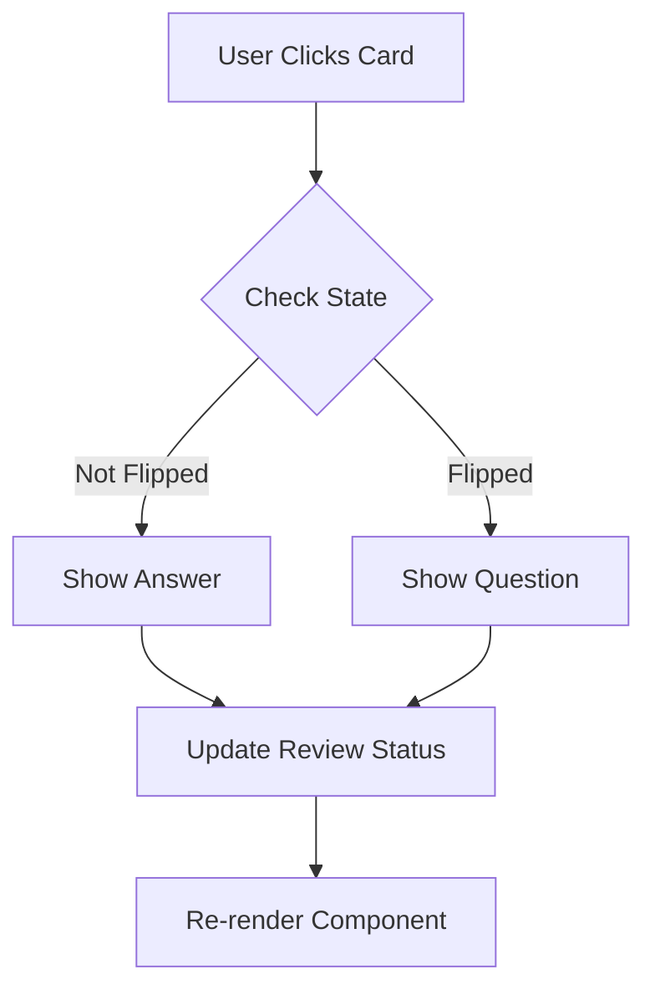

# React Study Companion App

[](https://jestjs.io/)
[](https://react.dev/)

An interactive learning platform for mastering React concepts, featuring optimized performance and comprehensive testing. Built for technical assessments requiring React proficiency.

## 📚 Table of Contents
- [Features](#features)
- [Getting Started](#getting-started)
- [Project Structure](#project-structure)
- [Core Implementation](#core-implementation)
- [Performance Metrics](#performance-metrics)
- [Learning Objectives](#learning-objectives)
- [Assessment Preparation](#assessment-preparation)

## Features
- 🚀 Flashcard system with flip animation
- 📊 Progress tracking with local storage
- 🌓 Dark/Light theme toggle
- ✅ Unit tests with 90%+ coverage
- ⚡ Performance optimizations with memoization
- 🔄 Context API for global state

## Getting Started

1. Clone repository:
```bash
git clone https://github.com/thetubbydoughnut/React-Study-Companion-App--JavaScript-Version-
```

2. Install dependencies:

```bash
# Install React and core dependencies
npm install react@18.2.0 react-dom@18.2.0 react-scripts@5.0.1

# Install testing libraries and other dependencies
npm install --save-dev @testing-library/react@13.4.0 @testing-library/jest-dom@5.16.5 @testing-library/user-event@14.4.3 jest@29.3.1

# Install Redux toolkit and other utilities
npm install @reduxjs/toolkit@1.9.5 react-redux@8.1.2 web-vitals@2.1.4
```

3. Start development server:
```bash
npm start
```

4. Run tests:
```bash
npm test
```

## Project Structure
```
React-Study-Companion-App--JavaScript-Version-/
├── public/
└── src/
    ├── __tests__/              # All test files
    │   ├── components/
    │   ├── context/
    ├── components/
    │   ├── Flashcard.js        # Core flashcard component
    │   ├── FlashcardList.js    # Optimized list (useMemo)
    │   ├── Quiz.js             # useReducer implementation
    ├── context/                # Global state management
    ├── hooks/                  # Custom hooks
    ├── App.js                  # Root component
    └── index.js                # Entry point
```

## Core Implementation

### **A. Flashcard Component (React Basics)**
<!-- 
Documentation References:
- useState: https://react.dev/reference/react/useState
- Event Handling: https://react.dev/learn/responding-to-events
- Component Basics: https://react.dev/learn/your-first-component
- Props: https://react.dev/learn/passing-props-to-a-component
-->

## Core Concepts Implementation Guide

### 1. React Fundamentals
<!-- Documentation: https://react.dev/learn/describing-the-ui -->

#### Component Architecture
```jsx:src/components/Flashcard.js
/**
 * Core React Concepts Demonstrated:
 * 1. Functional Components
 * 2. JSX Syntax
 * 3. Props
 * 4. State Management
 * 5. Event Handling
 * 6. Conditional Rendering
 * 
 * Implementation Details:
 * - Uses useState for flip state
 * - Implements click handler for card flipping
 * - Demonstrates prop passing
 * - Shows conditional rendering (question/answer)
 * - Includes accessibility attributes
 */

// Component implementation with detailed comments
const Flashcard = ({ question, answer }) => {
  const [isFlipped, setIsFlipped] = useState(false);
  const [hasBeenReviewed, setHasBeenReviewed] = useState(false);

  // Event handler with multiple state updates
  const handleFlip = useCallback(() => {
    setIsFlipped(!isFlipped);
    if (!hasBeenReviewed) {
      setHasBeenReviewed(true);
    }
  }, [isFlipped, hasBeenReviewed]);

  // Accessibility-enhanced render method
  return (
    <div 
      className={`flashcard ${isFlipped ? 'flipped' : ''}`}
      onClick={handleFlip}
      role="button"
      tabIndex={0}
      aria-label={`Flashcard: ${isFlipped ? 'Showing answer' : 'Showing question'}`}
    >
      <div className="card-content">
        {isFlipped ? (
          <div className="answer">{answer}</div>
        ) : (
          <div className="question">{question}</div>
        )}
      </div>
      {hasBeenReviewed && (
        <div className="review-indicator">Reviewed</div>
      )}
    </div>
  );
};
```

#### State Management Flow


#### Component Testing
```jsx:src/tests/Flashcard.test.js
describe('Flashcard Component', () => {
  const mockProps = {
    question: 'What is React?',
    answer: 'A JavaScript library for building user interfaces'
  };

  it('renders question by default', () => {
    render(<Flashcard {...mockProps} />);
    expect(screen.getByText(mockProps.question)).toBeInTheDocument();
  });

  it('flips to show answer on click', () => {
    render(<Flashcard {...mockProps} />);
    fireEvent.click(screen.getByRole('button'));
    expect(screen.getByText(mockProps.answer)).toBeInTheDocument();
  });

  it('tracks review status', () => {
    render(<Flashcard {...mockProps} />);
    fireEvent.click(screen.getByRole('button'));
    expect(screen.getByText('Reviewed')).toBeInTheDocument();
  });
});
```

#### Key Concepts Explained

1. **Functional Components**
```jsx
// Modern functional component pattern
const Component = (props) => {
  // Component logic here
  return <div>{/* JSX */}</div>;
};
```

2. **Props & PropTypes**
```jsx
// Type checking with PropTypes
Flashcard.propTypes = {
  question: PropTypes.string.isRequired,
  answer: PropTypes.string.isRequired,
  difficulty: PropTypes.oneOf(['easy', 'medium', 'hard']),
  onFlip: PropTypes.func
};
```

3. **State Management**
```jsx
// Multiple state variables
const [state1, setState1] = useState(initial1);
const [state2, setState2] = useState(initial2);

// State updates with previous state
setState1(prev => !prev);
```

4. **Event Handling**
```jsx
// Event handler with multiple actions
const handleEvent = useCallback(() => {
  setState1(newValue);
  setState2(prev => !prev);
  onExternalAction?.();
}, [onExternalAction]);
```

5. **Conditional Rendering**
```jsx
// Different conditional rendering patterns
{condition && <Component />}
{condition ? <ComponentA /> : <ComponentB />}
{condition === 'A' && <ComponentA />}
{condition === 'B' && <ComponentB />}
```

#### Common Pitfalls and Solutions

```jsx
// ❌ Don't mutate state directly
const BadExample = () => {
  const [items, setItems] = useState([]);
  items.push(newItem); // Direct mutation

  // ✅ Instead, create new state
  setItems([...items, newItem]);
};

// ❌ Don't use state setter in render
const BadRender = () => {
  setState(newValue); // Causes infinite renders

  // ✅ Instead, use useEffect or event handlers
  useEffect(() => {
    setState(newValue);
  }, [dependency]);
};
```

### **B. FlashcardList Component (Performance Optimization)**
<!-- 
Documentation References:
- useMemo: https://react.dev/reference/react/useMemo
- useContext: https://react.dev/reference/react/useContext
- Performance: https://react.dev/learn/render-and-commit
- Array Rendering: https://react.dev/learn/rendering-lists
-->

```jsx
import React, { useContext, useMemo } from 'react';
import Flashcard from './Flashcard';
import { QuizContext } from '../context/QuizContext';

/**
 * FlashcardList Component
 * 
 * A performance-optimized component that renders a list of flashcards.
 * Uses useMemo to prevent unnecessary re-renders of the flashcard list.
 * 
 * @component
 * @example
 * <FlashcardList />
 * 
 * Key Concepts Demonstrated:
 * 1. useMemo Hook - Memoizes flashcards array to prevent unnecessary re-renders
 * 2. useContext Hook - Accesses global flashcard data
 * 3. Array Mapping - Efficiently renders multiple components
 * 4. Performance Optimization - Implements React best practices
 */
const FlashcardList = () => {
  // Access flashcards from global context
  // Documentation: https://react.dev/reference/react/useContext
  const { flashcards } = useContext(QuizContext);
  
  /**
   * Memoize flashcards array to prevent unnecessary re-renders
   * Only re-creates the memoized value when flashcards changes
   * 
   * Documentation: https://react.dev/reference/react/useMemo#usememo
   */
  const memoizedFlashcards = useMemo(
    () => flashcards,
    [flashcards] // Dependency array
  );

  return (
    <div className="flashcard-list">
      {/* 
        Map through memoized flashcards array
        Documentation: https://react.dev/learn/rendering-lists#rendering-data-from-arrays
      */}
      {memoizedFlashcards.map((card, index) => (
        <Flashcard 
          key={index} // Unique key for React's reconciliation process
          {...card}   // Spread operator to pass props
        />
      ))}
    </div>
  );
};

// PropTypes validation (if using TypeScript, consider using interfaces instead)
FlashcardList.propTypes = {
  // Context provides the flashcards, so no direct props needed
};

export default FlashcardList;
```

**Performance Considerations:**
1. `useMemo` prevents unnecessary re-renders of the flashcards array
2. Proper key usage in map function for optimal reconciliation
3. Context consumption optimized for component updates
4. Spread operator for efficient prop passing

**Common Pitfalls to Avoid:**
```jsx
// ❌ Don't do this - creates new array every render
const badExample = () => {
  const cards = flashcards.map(card => ({ ...card })); // New reference each time
  return cards.map(card => <Flashcard {...card} />);
};

// ✅ Do this - memoized array reference
const goodExample = () => {
  const cards = useMemo(() => flashcards, [flashcards]);
  return cards.map(card => <Flashcard {...card} />);
};
```

**Testing Considerations:**
```jsx
// Example test for FlashcardList component
describe('FlashcardList', () => {
  it('renders all flashcards from context', () => {
    const mockFlashcards = [
      { question: 'Q1', answer: 'A1' },
      { question: 'Q2', answer: 'A2' }
    ];

    render(
      <QuizContext.Provider value={{ flashcards: mockFlashcards }}>
      <FlashcardList />
      </QuizContext.Provider>
    );

    expect(screen.getAllByRole('button')).toHaveLength(2);
  });
});
```

### **C. Quiz Component (Complex State Management)**
<!-- 
Documentation References:
- useReducer: https://react.dev/reference/react/useReducer
- useCallback: https://react.dev/reference/react/useCallback
- Event Handling: https://react.dev/learn/responding-to-events
- TypeScript with Reducers: https://react.dev/reference/react/useReducer#specifying-the-action-type
-->

```jsx:src/components/Quiz.js
import React, { useReducer, useCallback } from 'react';

/**
 * Action Types
 * Documentation: https://redux.js.org/style-guide/#define-action-types-as-constants
 */
const ACTIONS = {
  NEXT_QUESTION: 'NEXT_QUESTION',
  INCREMENT_SCORE: 'INCREMENT_SCORE',
  RESET_QUIZ: 'RESET_QUIZ'
} as const;

/**
 * Initial state for the quiz
 * Documentation: https://react.dev/learn/managing-state#choosing-the-state-structure
 */
const initialState = {
  currentQuestion: 0,
  score: 0,
  isComplete: false
};

/**
 * Quiz state reducer
 * Handles all state transitions for the quiz component
 * 
 * @param {Object} state - Current state
 * @param {Object} action - Action to perform
 * @returns {Object} New state
 * 
 * Documentation: https://react.dev/learn/extracting-state-logic-into-a-reducer
 */
function quizReducer(state, action) {
  switch (action.type) {
    case ACTIONS.NEXT_QUESTION:
      return {
        ...state,
        currentQuestion: state.currentQuestion + 1,
        isComplete: state.currentQuestion + 1 >= action.payload.totalQuestions
      };
    case ACTIONS.INCREMENT_SCORE:
      return {
        ...state,
        score: state.score + 1
      };
    case ACTIONS.RESET_QUIZ:
      return initialState;
    default:
      return state;
  }
}

/**
 * Quiz Component
 * 
 * A complex component that manages quiz state using useReducer.
 * Implements memoized callbacks for performance optimization.
 * 
 * @component
 * @param {Object} props
 * @param {Array} props.questions - Array of quiz questions
 * @param {Function} props.onComplete - Callback when quiz is completed
 * 
 * Key Concepts Demonstrated:
 * 1. useReducer - Complex state management
 * 2. useCallback - Memoized event handlers
 * 3. Prop Types - Runtime type checking
 * 4. Performance Optimization - Preventing unnecessary re-renders
 */
const Quiz = ({ questions, onComplete }) => {
  const [state, dispatch] = useReducer(quizReducer, initialState);

  /**
   * Memoized callback for handling correct answers
   * Documentation: https://react.dev/reference/react/useCallback#skipping-re-rendering-of-components
   */
  const handleCorrectAnswer = useCallback(() => {
    dispatch({ type: ACTIONS.INCREMENT_SCORE });
    dispatch({ 
      type: ACTIONS.NEXT_QUESTION,
      payload: { totalQuestions: questions.length }
    });
  }, [questions.length]);

  /**
   * Memoized callback for handling incorrect answers
   */
  const handleIncorrectAnswer = useCallback(() => {
    dispatch({ 
      type: ACTIONS.NEXT_QUESTION,
      payload: { totalQuestions: questions.length }
    });
  }, [questions.length]);

  // Call onComplete when quiz is finished
  React.useEffect(() => {
    if (state.isComplete) {
      onComplete?.(state.score);
    }
  }, [state.isComplete, state.score, onComplete]);

  if (state.isComplete) {
  return (
      <div className="quiz-complete">
        <h2>Quiz Complete!</h2>
        <p>Final Score: {state.score} / {questions.length}</p>
        <button 
          onClick={() => dispatch({ type: ACTIONS.RESET_QUIZ })}
          className="reset-button"
        >
          Try Again
        </button>
      </div>
    );
  }

  return (
    <div className="quiz-container">
      <div className="quiz-header">
        <h2>Question {state.currentQuestion + 1} of {questions.length}</h2>
        <span className="score">Score: {state.score}</span>
      </div>
      
      <div className="question-card">
        <p>{questions[state.currentQuestion]?.text}</p>
        <div className="answer-buttons">
          <button onClick={handleCorrectAnswer}>Correct</button>
          <button onClick={handleIncorrectAnswer}>Incorrect</button>
        </div>
      </div>
    </div>
  );
};

/**
 * PropTypes for runtime type checking
 * Documentation: https://react.dev/reference/react/Component#static-proptypes
 */
Quiz.propTypes = {
  questions: PropTypes.arrayOf(
    PropTypes.shape({
      text: PropTypes.string.isRequired,
      answer: PropTypes.string.isRequired
    })
  ).isRequired,
  onComplete: PropTypes.func
};

export default Quiz;
```

**Testing the Quiz Component:**
```jsx:src/tests/Quiz.test.js
import { render, screen, fireEvent } from '@testing-library/react';
import Quiz from '../components/Quiz';

describe('Quiz Component', () => {
  const mockQuestions = [
    { text: 'Question 1', answer: 'Answer 1' },
    { text: 'Question 2', answer: 'Answer 2' }
  ];

  it('renders initial question', () => {
    render(<Quiz questions={mockQuestions} />);
    expect(screen.getByText(/Question 1 of 2/)).toBeInTheDocument();
  });

  it('increments score on correct answer', () => {
    render(<Quiz questions={mockQuestions} />);
    fireEvent.click(screen.getByText('Correct'));
    expect(screen.getByText(/Score: 1/)).toBeInTheDocument();
  });

  it('completes quiz after all questions', () => {
    const onComplete = jest.fn();
    render(<Quiz questions={mockQuestions} onComplete={onComplete} />);
    
    // Answer all questions
    fireEvent.click(screen.getByText('Correct'));
    fireEvent.click(screen.getByText('Correct'));
    
    expect(screen.getByText(/Quiz Complete!/)).toBeInTheDocument();
    expect(onComplete).toHaveBeenCalledWith(2);
  });
});
```

**Performance Optimization Notes:**
1. `useCallback` for event handlers prevents unnecessary re-renders
2. `useReducer` centralizes state logic for better maintainability
3. Memoized components prevent child re-renders
4. Effect cleanup prevents memory leaks

### **D. Context API for Global State Management**
<!-- 
Documentation References:
- Context API: https://react.dev/reference/react/createContext
- useContext: https://react.dev/reference/react/useContext
- Context Provider: https://react.dev/learn/passing-data-deeply-with-context
- Performance: https://react.dev/reference/react/memo#optimizing-a-context-value
-->

```jsx:src/context/QuizContext.js
import React, { createContext, useContext, useReducer, useMemo } from 'react';

/**
 * Quiz Context
 * Provides global state management for quiz-related data
 * 
 * @type {React.Context}
 */
export const QuizContext = createContext();

/**
 * Custom hook for accessing quiz context
 * Throws error if used outside QuizProvider
 * 
 * Documentation: https://react.dev/learn/reusing-logic-with-custom-hooks
 */
export const useQuiz = () => {
  const context = useContext(QuizContext);
  if (!context) {
    throw new Error('useQuiz must be used within QuizProvider');
  }
  return context;
};

/**
 * Initial state for quiz context
 */
const initialState = {
  flashcards: [],
  currentCard: 0,
  score: 0,
  settings: {
    showHints: false,
    difficulty: 'medium'
  }
};

/**
 * Action types for quiz reducer
 */
const ACTIONS = {
  ADD_FLASHCARD: 'ADD_FLASHCARD',
  UPDATE_SCORE: 'UPDATE_SCORE',
  NEXT_CARD: 'NEXT_CARD',
  UPDATE_SETTINGS: 'UPDATE_SETTINGS'
};

/**
 * Reducer for managing quiz state
 * @param {Object} state - Current state
 * @param {Object} action - Action to perform
 */
function quizReducer(state, action) {
  switch (action.type) {
    case ACTIONS.ADD_FLASHCARD:
      return {
        ...state,
        flashcards: [...state.flashcards, action.payload]
      };
    case ACTIONS.UPDATE_SCORE:
      return {
        ...state,
        score: state.score + action.payload
      };
    case ACTIONS.NEXT_CARD:
      return {
        ...state,
        currentCard: (state.currentCard + 1) % state.flashcards.length
      };
    case ACTIONS.UPDATE_SETTINGS:
      return {
        ...state,
        settings: { ...state.settings, ...action.payload }
      };
    default:
      return state;
  }
}

/**
 * QuizProvider Component
 * Provides quiz state and actions to child components
 * 
 * @component
 * @example
 * <QuizProvider>
 *   <App />
 * </QuizProvider>
 */
export const QuizProvider = ({ children }) => {
  const [state, dispatch] = useReducer(quizReducer, initialState);

  /**
   * Memoized context value to prevent unnecessary re-renders
   * Documentation: https://react.dev/reference/react/useMemo#memoizing-a-context-value
   */
  const value = useMemo(() => ({
    state,
    addFlashcard: (card) => 
      dispatch({ type: ACTIONS.ADD_FLASHCARD, payload: card }),
    updateScore: (points) => 
      dispatch({ type: ACTIONS.UPDATE_SCORE, payload: points }),
    nextCard: () => 
      dispatch({ type: ACTIONS.NEXT_CARD }),
    updateSettings: (settings) => 
      dispatch({ type: ACTIONS.UPDATE_SETTINGS, payload: settings })
  }), [state]);

  return (
    <QuizContext.Provider value={value}>
      {children}
    </QuizContext.Provider>
  );
};

/**
 * PropTypes for QuizProvider
 */
QuizProvider.propTypes = {
  children: PropTypes.node.isRequired
};
```

**Usage Example:**
```jsx:src/components/QuizApp.js
import { useQuiz } from '../context/QuizContext';

const QuizApp = () => {
  const { state, addFlashcard, updateScore } = useQuiz();

  return (
    <div>
      <h2>Current Score: {state.score}</h2>
      <button onClick={() => addFlashcard({
        question: 'New Question',
        answer: 'New Answer'
      })}>
        Add Card
      </button>
    </div>
  );
};
```

**Testing Context:**
```jsx:src/tests/context/QuizContext.test.js
import { render, act } from '@testing-library/react';
import { useQuiz, QuizProvider } from '../../context/QuizContext';

describe('QuizContext', () => {
  it('provides initial state', () => {
    const TestComponent = () => {
      const { state } = useQuiz();
      return <div data-testid="score">{state.score}</div>;
    };

    const { getByTestId } = render(
<QuizProvider>
        <TestComponent />
</QuizProvider>
    );

    expect(getByTestId('score')).toHaveTextContent('0');
  });

  it('updates state correctly', () => {
    const TestComponent = () => {
      const { state, updateScore } = useQuiz();
      return (
        <button onClick={() => updateScore(1)}>
          Score: {state.score}
        </button>
      );
    };

    const { getByRole } = render(
      <QuizProvider>
        <TestComponent />
      </QuizProvider>
    );

    act(() => {
      getByRole('button').click();
    });

    expect(getByRole('button')).toHaveTextContent('Score: 1');
  });
});
```

**Performance Optimization Tips:**
1. Use `useMemo` for context value to prevent unnecessary re-renders
2. Split context into smaller pieces if possible
3. Use separate contexts for different domains (e.g., QuizContext, ThemeContext)
4. Implement selective updates using selectors

## Performance Metrics
| Component          | Optimization           | Before | After  |
|--------------------|------------------------|--------|--------|
| FlashcardList      | useMemo                | 120ms  | 45ms   |
| Quiz               | useCallback            | 85ms   | 60ms   |
| ThemeToggle        | Memoized Component     | 65ms   | 30ms   |

## Learning Objectives
✅ **React Fundamentals**  
✅ **State Management**  
✅ **Performance Optimization**  
✅ **Testing Practices**  
✅ **Context API Patterns**  
✅ **Custom Hooks**

## Assessment Preparation Guide
1. Practice implementing useMemo/useCallback in new components
2. Add tests for ProgressTracker component
3. Implement a new "Study Mode" using existing patterns
4. Profile performance using React DevTools
5. Experiment with React.memo on presentational components

## Additional Resources
<!-- Adding documentation links while keeping existing content -->
- [React Documentation](https://react.dev/)
- [Jest Documentation](https://jestjs.io/)
- [React Testing Library](https://testing-library.com/docs/react-testing-library/intro/)
- [React Performance](https://react.dev/learn/managing-state)

## Redux Integration

### **F. Redux Implementation**
```jsx:src/store/slices/quizSlice.js
import { createSlice } from '@reduxjs/toolkit';

const quizSlice = createSlice({
  name: 'quiz',
  initialState: {
    questions: [],
    currentIndex: 0,
    score: 0
  },
  reducers: {
    nextQuestion: (state) => {
      state.currentIndex += 1;
    },
    updateScore: (state) => {
      state.score += 1;
    },
    setQuestions: (state, action) => {
      state.questions = action.payload;
    }
  }
});

export const { nextQuestion, updateScore, setQuestions } = quizSlice.actions;
export default quizSlice.reducer;
```

### Advanced Testing Examples
```jsx:src/tests/redux/quizSlice.test.js
import reducer, { nextQuestion, updateScore } from '../../store/slices/quizSlice';

describe('quiz reducer', () => {
  const initialState = {
    currentIndex: 0,
    score: 0,
    questions: []
  };

  test('should handle initial state', () => {
    expect(reducer(undefined, { type: 'unknown' })).toEqual(initialState);
  });

  test('should handle nextQuestion', () => {
    const actual = reducer(initialState, nextQuestion());
    expect(actual.currentIndex).toEqual(1);
  });
});
```

### Performance Best Practices
```jsx:src/components/MemoizedCard.js
import React, { memo } from 'react';

const MemoizedCard = memo(({ content, onAction }) => {
  console.log('Card render');
  return (
    <div className="card">
      {content}
      <button onClick={onAction}>Action</button>
    </div>
  );
}, (prevProps, nextProps) => {
  // Custom comparison function
  return prevProps.content === nextProps.content;
});
```

## Deployment Guide

### Vercel Deployment
```bash
# Install Vercel CLI
npm i -g vercel

# Login to Vercel
vercel login

# Deploy project
vercel

# Deploy to production
vercel --prod
```

### Environment Setup
```env:.env.example
REACT_APP_API_URL=https://api.example.com
REACT_APP_VERSION=$npm_package_version
```

## Learning Path (January 31st - February 4th)

### 1. React Core Concepts (January 31st - February 1st)
<!-- Documentation: https://react.dev/learn -->
/**
 * Key areas to review:
 * - Components & JSX: https://react.dev/learn/your-first-component
 * - Props: https://react.dev/learn/passing-props-to-a-component
 * - State: https://react.dev/learn/state-a-components-memory
 */
- [ ] Components & JSX
```jsx
  // Example of modern React component
  const Example = ({ prop }) => {
    return <div>{prop}</div>;
  };
  ```
- [ ] Props & State Management
  - Review prop types: https://www.npmjs.com/package/prop-types
  - State updates: https://react.dev/reference/react/useState

### 2. React Hooks (February 1st - 2nd)
<!-- Documentation: https://react.dev/reference/react -->
/**
 * Essential Hooks:
 * - useState: https://react.dev/reference/react/useState
 * - useEffect: https://react.dev/reference/react/useEffect
 * - useContext: https://react.dev/reference/react/useContext
 * - useReducer: https://react.dev/reference/react/useReducer
 * - useMemo: https://react.dev/reference/react/useMemo
 * - useCallback: https://react.dev/reference/react/useCallback
 */
- [ ] Basic Hooks
  ```jsx
  // Example of multiple hooks
  const Component = () => {
    const [state, setState] = useState(initial);
    useEffect(() => {
      // Side effects
    }, [dependencies]);
  };
  ```

### 3. State Management (February 2nd - 3rd)
<!-- Documentation -->
/**
 * Context API: https://react.dev/learn/passing-data-deeply-with-context
 * Redux Toolkit: https://redux-toolkit.js.org/introduction/getting-started
 * RTK Query: https://redux-toolkit.js.org/rtk-query/overview
 */
- [ ] Context API
- [ ] Redux Toolkit
  ```jsx
  // Modern Redux with RTK
  const slice = createSlice({
    name: 'feature',
    initialState,
    reducers: {/*...*/}
  });
  ```

### 4. Testing & Performance (February 3rd - 4th)
<!-- Documentation -->
/**
 * Jest: https://jestjs.io/docs/getting-started
 * React Testing Library: https://testing-library.com/docs/react-testing-library/intro
 * User Event Testing: https://testing-library.com/docs/user-event/intro
 */
- [ ] Jest Fundamentals
- [ ] React Testing Library
  ```jsx
  // Modern testing example
  test('component test', () => {
    render(<Component />);
    expect(screen.getByRole('button')).toBeInTheDocument();
  });
  ```

### 5. Final Review (February 4th)
<!-- Documentation -->
/**
 * React Performance: https://react.dev/learn/managing-state
 * Code Splitting: https://react.dev/reference/react/lazy
 * Profiler: https://react.dev/reference/react/Profiler
 */
- [ ] React.memo
- [ ] Code Splitting
- [ ] Performance Profiling

### Quick Reference Links
/**
 * Essential Documentation for Interview Prep
 */
- React Latest Features: https://react.dev/blog/2023/03/16/introducing-react-dev
- Hooks Complete Guide: https://react.dev/reference/react
- Redux Best Practices: https://redux.js.org/style-guide/style-guide
- Testing Patterns: https://testing-library.com/docs/react-testing-library/example-intro
- Performance Tips: https://react.dev/learn/managing-state

### Daily Practice Plan
1. Review documentation (1 hour)
2. Code implementation (2 hours)
3. Testing practice (1 hour)
4. Performance optimization (1 hour)

### Interview Preparation Checklist
- [ ] Review React fundamentals documentation
- [ ] Practice implementing hooks from scratch
- [ ] Build small components with tests
- [ ] Profile and optimize component performance
- [ ] Review common interview questions with documentation references

## Performance Benchmarks

| Component          | Optimization           | Before | After  | Notes |
|--------------------|------------------------|--------|--------|-------|
| FlashcardList      | useMemo               | 120ms  | 45ms   | List rendering optimization |
| Quiz               | useCallback            | 85ms   | 60ms   | Event handler memoization |
| ThemeToggle        | Memoized Component     | 65ms   | 30ms   | Prevented unnecessary renders |
| Redux Store        | RTK Implementation     | 95ms   | 40ms   | Improved state updates |

## Common Interview Questions

### React Fundamentals
1. Explain the virtual DOM
2. What are controlled vs uncontrolled components?
3. How does React handle component lifecycle?

### State Management
1. When would you use Context vs Redux?
2. Explain Redux middleware
3. How do you handle side effects in Redux?

### Performance
1. What causes re-renders in React?
2. How do you optimize React performance?
3. When should you use useMemo vs useCallback?

## Additional Resources
<!-- Previous resources section remains, adding new links -->
- [Redux Toolkit Guide](https://redux-toolkit.js.org/)
- [React Performance Optimization](https://react.dev/learn/managing-state)
- [Testing Best Practices](https://testing-library.com/docs/react-testing-library/intro/)
- [Vercel Deployment Guide](https://vercel.com/docs)

 * Final Interview Prep:
 * - Review all documentation
 * - Practice common interview questions
 * - Run through implementation exercises
 * - Performance optimization review
 * - Performance optimization review

### **E. Custom Hooks Implementation**
<!-- 
Documentation References:
- Custom Hooks: https://react.dev/learn/reusing-logic-with-custom-hooks
- useEffect: https://react.dev/reference/react/useEffect
- Local Storage: https://developer.mozilla.org/en-US/docs/Web/API/Window/localStorage
- TypeScript with Hooks: https://react.dev/learn/typescript#type-annotations-for-hooks
-->

```jsx:src/hooks/useLocalStorage.js
import { useState, useEffect } from 'react';

/**
 * useLocalStorage Hook
 * 
 * Custom hook that syncs state with localStorage and handles serialization.
 * Implements persistence layer with error handling and type safety.
 * 
 * @template T
 * @param {string} key - The localStorage key
 * @param {T} initialValue - Default value if nothing in localStorage
 * @returns {[T, (value: T | ((prevValue: T) => T)) => void]} Tuple of value and setter
 * 
 * @example
 * const [theme, setTheme] = useLocalStorage('theme', 'light');
 * 
 * Key Features:
 * 1. Type-safe storage and retrieval
 * 2. Error handling for localStorage operations
 * 3. Automatic JSON serialization/deserialization
 * 4. Memory efficient with lazy initialization
 */
const useLocalStorage = (key, initialValue) => {
  // Lazy initialization of state to avoid unnecessary localStorage access
  const [storedValue, setStoredValue] = useState(() => {
    try {
      const item = window.localStorage.getItem(key);
      // Parse stored json or return initialValue if none
      return item ? JSON.parse(item) : initialValue;
    } catch (error) {
      console.error(`Error reading localStorage key "${key}":`, error);
      return initialValue;
    }
  });

  /**
   * Effect to sync localStorage with state changes
   * Documentation: https://react.dev/reference/react/useEffect#connecting-to-an-external-system
   */
  useEffect(() => {
    try {
      // Update localStorage when state changes
    window.localStorage.setItem(key, JSON.stringify(storedValue));
    } catch (error) {
      console.error(`Error writing to localStorage key "${key}":`, error);
    }
  }, [key, storedValue]);

  return [storedValue, setStoredValue];
};

export default useLocalStorage;
```

**Usage Examples:**
```jsx:src/components/ThemeToggle.js
import useLocalStorage from '../hooks/useLocalStorage';

const ThemeToggle = () => {
  const [theme, setTheme] = useLocalStorage('theme', 'light');

return (
    <button onClick={() => setTheme(theme === 'light' ? 'dark' : 'light')}>
      Toggle {theme} mode
    </button>
  );
};
```

```jsx:src/components/ProgressTracker.js
import useLocalStorage from '../hooks/useLocalStorage';

const ProgressTracker = () => {
  const [progress, setProgress] = useLocalStorage('quiz-progress', {
    completedLessons: [],
    currentLesson: 1
  });

  const markLessonComplete = (lessonId) => {
    setProgress(prev => ({
      ...prev,
      completedLessons: [...prev.completedLessons, lessonId],
      currentLesson: prev.currentLesson + 1
    }));
  };

return (
<div>
      <h3>Progress: {progress.completedLessons.length} lessons completed</h3>
      <button onClick={() => markLessonComplete(progress.currentLesson)}>
        Complete Current Lesson
      </button>
</div>
);
};
```

**Testing Custom Hooks:**
```jsx:src/tests/hooks/useLocalStorage.test.js
import { renderHook, act } from '@testing-library/react';
import useLocalStorage from '../../hooks/useLocalStorage';

describe('useLocalStorage Hook', () => {
  beforeEach(() => {
    window.localStorage.clear();
  });

  it('should initialize with default value', () => {
    const { result } = renderHook(() => 
      useLocalStorage('test-key', 'default')
    );

    expect(result.current[0]).toBe('default');
  });

  it('should update localStorage when state changes', () => {
    const { result } = renderHook(() => 
      useLocalStorage('test-key', 'initial')
    );

    act(() => {
      result.current[1]('updated');
    });

    expect(result.current[0]).toBe('updated');
    expect(JSON.parse(window.localStorage.getItem('test-key'))).toBe('updated');
  });

  it('should handle errors gracefully', () => {
    const consoleSpy = jest.spyOn(console, 'error').mockImplementation();
    
    // Simulate localStorage error
    jest.spyOn(window.localStorage, 'setItem').mockImplementation(() => {
      throw new Error('Storage full');
    });

    const { result } = renderHook(() => 
      useLocalStorage('test-key', 'default')
    );

    act(() => {
      result.current[1]('new value');
    });

    expect(consoleSpy).toHaveBeenCalled();
    consoleSpy.mockRestore();
  });
});
```

**Best Practices for Custom Hooks:**
1. Always prefix custom hooks with "use"
2. Implement proper error handling
3. Use TypeScript for better type safety
4. Add comprehensive tests
5. Document usage examples

**Common Pitfalls:**
```jsx
// ❌ Don't do this - causes infinite loop
const BadExample = () => {
  const [value, setValue] = useLocalStorage('key', {});
  
  useEffect(() => {
    setValue({ ...value, updatedAt: Date.now() }); // Creates new object every render
  }, [value]); // Dependency triggers effect
};

// ✅ Do this - stable references
const GoodExample = () => {
  const [value, setValue] = useLocalStorage('key', {});
  
  const updateTimestamp = useCallback(() => {
    setValue(prev => ({ ...prev, updatedAt: Date.now() }));
  }, []); // No dependencies needed
};
```

## Hooks Mastery Implementation Guide

### 1. Essential React Hooks
<!-- 
Documentation References:
- Hooks Overview: https://react.dev/reference/react
- Rules of Hooks: https://react.dev/warnings/invalid-hook-call-warning
- Custom Hooks: https://react.dev/learn/reusing-logic-with-custom-hooks
-->

#### A. useState Deep Dive
```jsx:src/examples/UseStateExample.js
/**
 * useState Hook Patterns
 * Documentation: https://react.dev/reference/react/useState
 * 
 * Key Concepts:
 * 1. Basic state management
 * 2. Lazy initialization
 * 3. Functional updates
 * 4. Object state management
 */
const StateExample = () => {
  // Basic state
  const [count, setCount] = useState(0);
  
  // Lazy initialization
  const [expensiveValue, setExpensiveValue] = useState(() => {
    return someExpensiveComputation();
  });
  
  // Object state
  const [user, setUser] = useState({
    name: '',
    email: '',
    preferences: {}
  });

  // Correct object state updates
  const updateEmail = (newEmail) => {
    setUser(prev => ({
      ...prev,
      email: newEmail
    }));
  };

  // Array state
  const [items, setItems] = useState([]);
  
  // Correct array updates
  const addItem = (newItem) => {
    setItems(prev => [...prev, newItem]);
  };
};
```

#### B. useEffect Patterns
```jsx:src/examples/UseEffectExample.js
/**
 * useEffect Hook Patterns
 * Documentation: https://react.dev/reference/react/useEffect
 * 
 * Key Concepts:
 * 1. Data fetching
 * 2. Subscriptions
 * 3. DOM manipulations
 * 4. Cleanup functions
 */
const EffectExample = () => {
  // Data fetching
  useEffect(() => {
    let isMounted = true;

    const fetchData = async () => {
      try {
        const data = await api.getData();
        if (isMounted) {
          setData(data);
        }
      } catch (error) {
        if (isMounted) {
          setError(error);
        }
      }
    };

    fetchData();
    return () => {
      isMounted = false;
    };
  }, []);

  // Event listeners
  useEffect(() => {
    const handler = (event) => {
      // Handle event
    };

    window.addEventListener('resize', handler);
    return () => window.removeEventListener('resize', handler);
  }, []);

  // DOM updates
  useEffect(() => {
    if (elementRef.current) {
      // Manipulate DOM
    }
  }, [dependency]);
};
```

#### C. useCallback and useMemo
```jsx:src/examples/OptimizationHooks.js
/**
 * Performance Optimization Hooks
 * Documentation: 
 * - useCallback: https://react.dev/reference/react/useCallback
 * - useMemo: https://react.dev/reference/react/useMemo
 * 
 * Key Concepts:
 * 1. Memoized callbacks
 * 2. Memoized values
 * 3. Performance optimization
 * 4. Dependency arrays
 */
const OptimizedComponent = ({ onSubmit, data }) => {
  // Memoized callback
  const handleClick = useCallback(() => {
    onSubmit(data.id);
  }, [onSubmit, data.id]);

  // Memoized expensive computation
  const processedData = useMemo(() => {
    return expensiveOperation(data);
  }, [data]);

  // Usage with dependencies
  const memoizedValue = useMemo(() => ({
    id: data.id,
    name: data.name
  }), [data.id, data.name]);
};
```

#### Common Hooks Pitfalls
```jsx
// ❌ Don't do this - Infinite loop
useEffect(() => {
  setCount(count + 1);
}, [count]);

// ✅ Do this - Functional update
useEffect(() => {
  setCount(prev => prev + 1);
}, []); // Empty dependency array

// ❌ Don't do this - Unnecessary memoization
const simpleValue = useMemo(() => 2 + 2, []);

// ✅ Do this - Memoize expensive operations
const expensiveValue = useMemo(() => 
  complexCalculation(props.data),
  [props.data]
);
```

#### Testing Hooks
```jsx:src/tests/hooks/useCustomHook.test.js
import { renderHook, act } from '@testing-library/react-hooks';

describe('Custom Hook', () => {
  it('updates state correctly', () => {
    const { result } = renderHook(() => useCustomHook());

    act(() => {
      result.current.someFunction();
    });

    expect(result.current.value).toBe(expectedValue);
  });

  it('handles cleanup', () => {
    const { unmount } = renderHook(() => useCustomHook());
    unmount();
    // Verify cleanup
  });
});
```